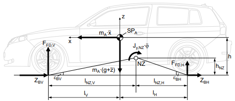

# dynamic-camber-control

### Sturzdefinition

Kücükay S.960

 

### Systemanforderungen

| ID      | Kategorie        | Priorität | Stakeholder | Status        | Link                                     |
|---------|------------------|-----------|-------------|---------------|------------------------------------------|
| SYS-001 | Funktional       | Muss      | Kunde       | nicht erfüllt | [mehr](docs/01_requirements/SYS-001.md)  |
| SYS-002 | Nicht-funktional | Soll      | Kunde       | nicht erfüllt |
| SYS-003 | Nicht-funktional | Soll      | Kunde       | nicht erfüllt |
| SYS-004 | Nicht-funktional | Soll      | Kunde       | nicht erfüllt |
| SYS-004 | Nicht-funktional | Kann      | Kunde       | nicht erfüllt |

 

### Herangehensweise
 Vertikalmodell liefert unter anderem Hubweg z oder Federwege zi woraus sich die Raderhebungskurve und damit ein Sturzwinkel ergibt. Dieser Sturzwinkel muss dann noch in einem Kennfeld korrigiert werden sodass sich der Sturzwinkel mit dem höchsten Kraftschlusspotential bei aktueller Fahrsituation ergibt
 

 

   
 
 

Vorteil von inklusion des Vertikalmodells ist das der aktuell eingestellte Sturzwinkel keine Rolle spielt, es wird lediglich das optimum bei in abhöngigkeit der Fahrsituation evaluiert.
 

Fragen:
- Gibt es einen Denkfehler im Regelkreis bzw. gibt es eine Situation in der das Vertikalmodell nicht notwendig ist?
- Verwendung des Vertikalmodells Zielführend?
- Wie verändert sich das Kennfeld mit der Raderhebung? 

 

### Vertikalmodell

aus Kücükay   

$z_1 = z - \sin(\kappa) \cdot (s_V/2) + \sin(\phi) \cdot l_{NZ,V}$ 
$z_1 = z + \sin(\kappa) \cdot (s_V/2) + \sin(\phi) \cdot l_{NZ,V}$ 
$z_1 = z - \sin(\kappa) \cdot (s_V/2) + \sin(\phi) \cdot (l - l_{NZ,V})$  
$z_1 = z + \sin(\kappa) \cdot (s_V/2) + \sin(\phi) \cdot (l - l_{NZ,V})$  
$F_{Fi}$

$$V_{sphere} = \frac{4}{3}\pi r^3$$
