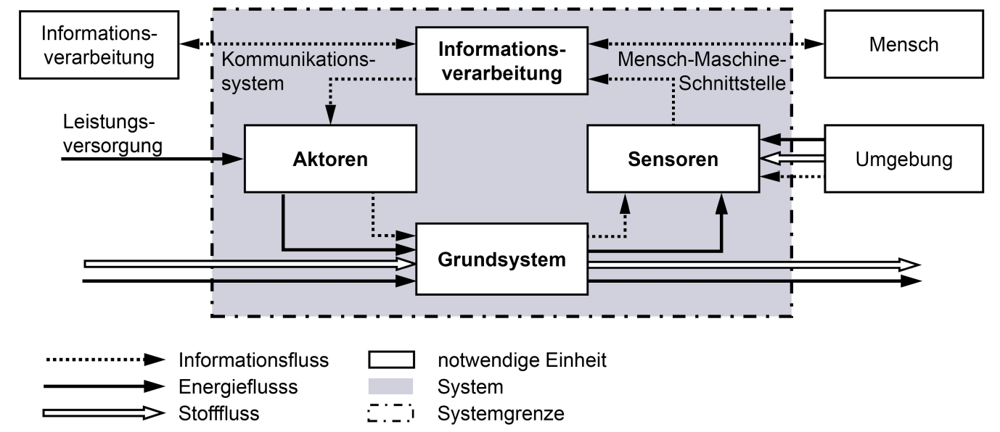

# CPS

„Steuerung physikalischer Vorgänge mittels Sensoren und Aktuatoren über Kommunikationseinrich-tungen mit den globalen digitalen Netzen (dem ‚Cyberspace‘). Dieser Typus von Systemen ermög-licht über Wirkketten eine Verbindung zwischen Vorgängen der physikalischen Realität und den heute verfügbaren digitalen Netzinfrastrukturen. Dies erlaubt vielfältige Applikationen mit hohem wirtschaftlichem Potenzial und starker Innova-tionskraft“

    Die Besonderheiten bei der Entwicklung von CPS liegen in der starken Vernetzung der hochintegrier-ten Systeme und in der Fähigkeit, Systemeigen-schaften während des laufenden Betriebs ohne direkten physischen Zugriff zu ändern. Hieraus ergeben sich hohe Anforderungen an das präventi-ve Qualitätsmanagement im Sinne einer kontinu-ierlichen Planung und Ausführung der Eigen-schaftsabsicherung mit dem Ziel, die Systemsi-cherheit herzustellen (Safety und Security). Zusätz-lich steigt die Komplexität der Systeme durch eine Vielzahl von dynamischen Abhängigkeiten und Systemelementen [45].